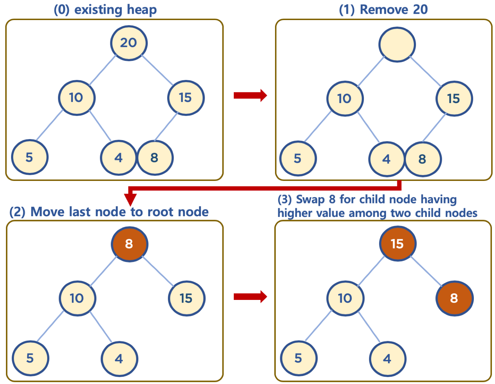

# Heap
## 힙(Heap)이란?
힙이란 완전 이진 트리의 일종으로 우선 순위 큐를 위해서 만들어진 자료구조이다.
    
    💡우선 순위 큐란?

    일반적으로 큐는 선입선출의 구조를 가지고 있지만 큐에서도 우선 순위를 판별하여 우선 순위가 높은 큐가 먼저 나가는 것을 우선 순위 큐라고 한다.

    우선 순위 큐는 배열이나 연결 리스트로도 구현이 가능하지만 힙으로 구현을 하는 것이 효율적이다.
    
    효율적인 이유가 여러가지가 있지만 그 중 하나는 삽입 및 삭제 연산의 효율성이다. 배열이나 연결리스트는 삽입과 삭제가 O(n)만큼 시간이 걸리게 되는데, 힙은 삽입과 삭제 연산이 O(log n)만큼 시간이 걸리기 때문에 배열이나 연결리스트로 구현을 하게 되면 크기가 커질수록 성능이 저하될 수가 있다.

힙은 여러 개의 값들 중에서 최대값이나 최솟값을 빠르게 찾아내는 것이 주요한 목적이며, 중복된 값을 허용한다.

힙이 완전 이진 트리의 자료구조를 가지면서 최대값이나 최솟값을 찾는 목적이라고 했는데, 그렇다면 탐색 이진 트리와의 차이를 비교할 수 있다.

탐색 이진 트리의 같은 경우는 중복된 값을 허용하지 않는다는 특징이 있지만 데이터 탐색의 목적이 가장 크다. 최대값이나 최솟값을 빠르게 찾아야 하는 힙과는 목적성이 약간 다르다.

## 힙(Heap)의 종류
힙은 크게 최대 힙(max Heap)과 최소 힙(min Heap)으로 구분할 수 있다.

    최대 힙: 부모 노드 >= 자식 노드
    최소 힙: 부모 노드 <= 자식 노드

 
*이미지 출처: https://gmlwjd9405.github.io/2018/05/10/data-structure-heap.html*

## 힙(Heap)의 동작과정
최대 힙(max Heap)을 예를 들어 동작하는 데이터의 삽입과 삭제를 수행하는 동작 과정은 아래와 같다.

### 삽입
힙은 완전 이진 트리의 구조를 띄고 있으므로 제일 왼쪽 하단부부터 작은 노드로 채워지는 것이 일반적이다.

 
*이미지 출처: https://heung-bae-lee.github.io/2020/05/17/data_structure_07/*

### 삭제
힙은 최대값이나 최솟값을 최상단 root노드에 두어서, 바로 찾아 꺼내 쓸 수 있도록 하는 구조이기 때문에 삭제는 root 노드를 삭제하는 것이 일반적이다.

최대값인 root 노드 삭제 $\rightarrow$ 가장 마지막에 추가된 최솟값 노드를 root로 이동 $\rightarrow$ root노드의 값이 child node보다 작을 경우 child node중 큰 값을 가진 노드와 교환 (반복) 의 순서로 삭제가 이루어진다.

 
*이미지 출처: https://heung-bae-lee.github.io/2020/05/17/data_structure_07/*

 
 
 

## _References_
- https://suyeon96.tistory.com/31
- https://velog.io/@gnwjd309/data-structure-heap
- https://gmlwjd9405.github.io/2018/05/10/data-structure-heap.html
- https://heung-bae-lee.github.io/2020/05/17/data_structure_07/