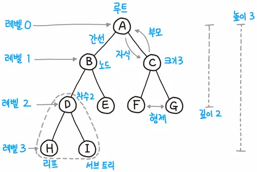

# Tree
## 1. 트리(Tree)란?
- 트리는 그래프의 일종으로 정점과 간선을 이용하여 데이터의 배치 형태를 추상화한 자료구조이다.
- 서로 다른 두 노드를 연결하는 길이 하나뿐이 그래프를 트리라고 한다.
- 힙(Heap)을 구성하는 방법 중 하나가 트리이다.

 
 

## 2. 특징
- 트리는 일반적으로 대상 정보의 각 항목들을 계층적으로 구조화할 때 사용하는 비선형 자료구조이다.
- 트리는 '데이터의 저장' 보다는 '저장된 데이터를 더 효과적으로 탐색'하기 위해서 주로 사용된다.
- 리스트와 다르게 데이터가 단순히 나열되는 구조가 아닌, 부모와 자식의 계층적인 관계로 표현된다.
- 트리는 루트노드를 제외한 모든 노드에서는 단 하나의 부모노드를 가진다.

 
 

## 3. 용어

*이미지 출처 : https://namu.wiki/w/%ED%8A%B8%EB%A6%AC(%EA%B7%B8%EB%9E%98%ED%94%84)

#### 1) 노드(node) : 트리를 구성하는 기본 요소
- 루트 노드(root node): 트리에서 부모가 없는 최상위 노드, 트리의 시발점
- 부모 노드(parent node): 루트 노드 방향으로 연결된 노드
- 자식 노드(child node): 루트 노드 반대 방향으로 연결된 노드
- 형제 노드(siblings node): 같이 부모 노드를 가지는 노드
- 리프 노드(leaf node): 자식 노드가 없는 노드
#### 2) 경로(path): 한 노드에서 다른 한 노드에 이르는 길 사이에 있는 노드들의 순서

#### 3) 길이(length): 출발 노드에서 도착 노드까지 거치는 간선의 개수
#### 4) 깊이(depth): 루트 경로의 길이
#### 5) 레벨(level): 루트 노드(level=0)부터 노드까지 연결된 간선 수의 합
#### 6) 크기(size): 노드의 개수
#### 7) 너비(width): 가장 많은 노드를 갖고 있는 레벨의 크기

 
 

## 3. 트리 종류

 
 

## 4. 활용 사례

 
 
 

## _References_